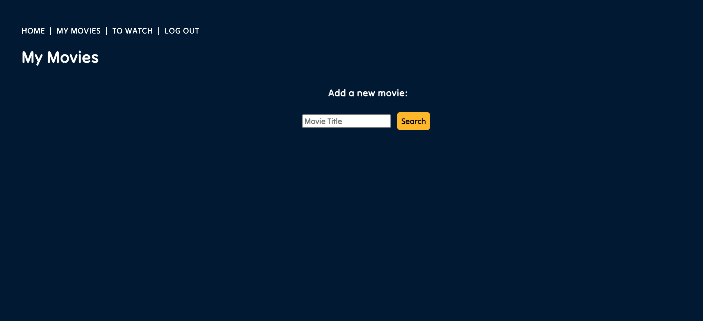
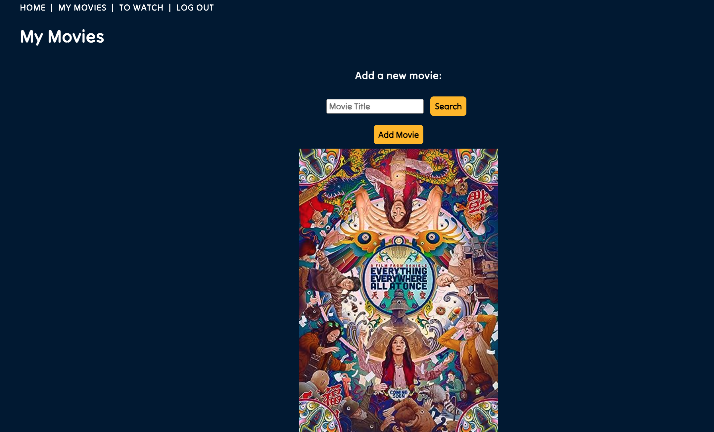
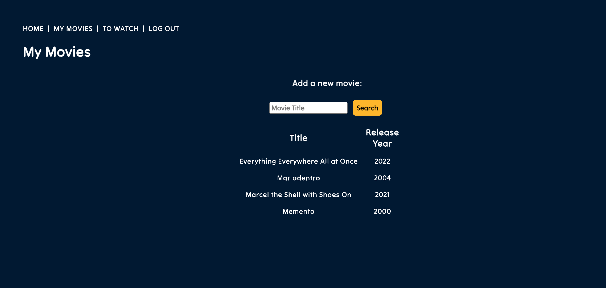
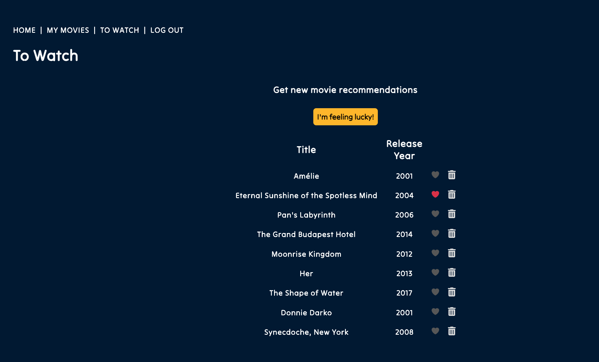

# Flixmate

Flixmate is a full-stack Node.js web application built with the Express framework and MongoDB for data persistence. The app is designed to provide personalized movie recommendations based on user preferences. Through its intuitive interface, users can search for movies, rate them, and receive tailored recommendations that enhance their movie-watching experiences.

# Screenshots

  

  

  

  

# Technologies Used

- Node.js (Express framework)
- MongoDB/Mongoose for the database
- OpenAI API for tailored recommendations
- OAuth for user authentication
- HTML/CSS/JavaScript for the frontend
- Heroku for deployment

# Getting Started

Here's the [link to the deployed app](https://flixmate-app-18ab50e8dc8c.herokuapp.com/). To get a closer look at the project's planning process, check out the [Trello board](https://trello.com/b/9jAeCLQU/sei).

# Next Steps

Planned future enhancements include:

- Implementing more robust prompt engineering with OpenAI API.
- Enabling users to view and interact with the movie lists of other users.
- Creating multiple lists for liked movies and recommendations, each with customizable presets.
